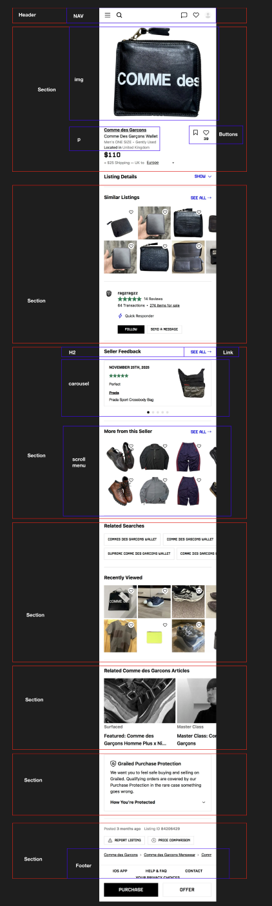
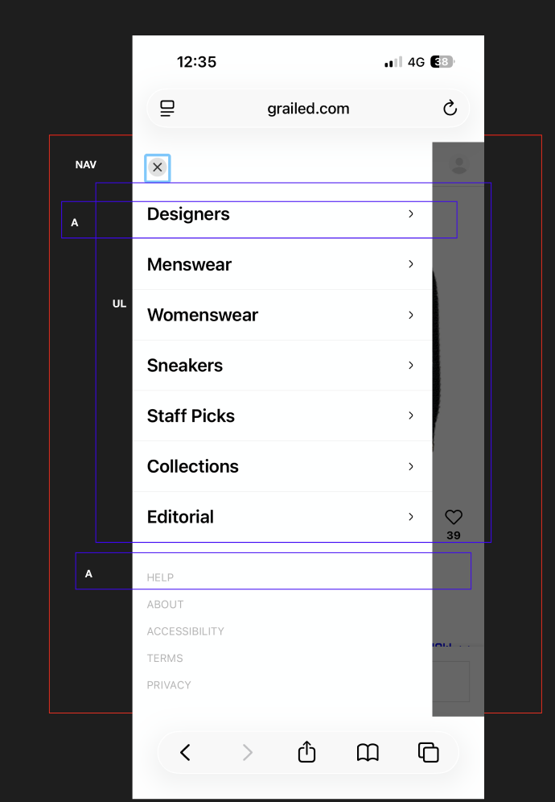

# Procesverslag
Markdown is een simpele manier om HTML te schrijven.  
Markdown cheat cheet: [Hulp bij het schrijven van Markdown](https://github.com/adam-p/markdown-here/wiki/Markdown-Cheatsheet).

Nb. De standaardstructuur en de spartaanse opmaak van de README.md zijn helemaal prima. Het gaat om de inhoud van je procesverslag. Besteedt de tijd voor pracht en praal aan je website.

Nb. Door *open* toe te voegen aan een *details* element kun je deze standaard open zetten. Fijn om dat steeds voor de relevante stuk(ken) te doen.

## Jij

  
uitwerken voor kick-off werkgroep

  ### Auteur:
 Jegor Mlokit

  #### Je startniveau:
 Blauw

  #### Je focus:
  surface
 

## Je website

  
uitwerken voor kick-off werkgroep

  ### Je opdracht:
  Het is de bedoeling dat ik 2 pagina's van Grailed ga proberen namaken.

  #### Screenshot(s) van de eerste pagina (small screen): 
  Homepagina van Grailed
  

  #### Screenshot(s) van de tweede pagina (small screen):

  
 

## Toegankelijkheidstest 1/2 (week 1)

  
uitwerken na test in 2e werkgroep

  ### Bevindingen
  Lijst met je bevindingen die in de test naar voren kwamen: Accessibility Grailed

Met slechte motoriek werkt grailed opzicht wel goed, ik kan alles gebruiken wat ik moet, het gaat wat moeizaam maar dat komt vooral doordat ik het niet gewend ben. 

Met de spasme simulator kan ik de website ook gebruiken zonder hindernissen die de website creëert .

Screenreader test Grailed:
De screenreader werkt goed op Grailed, hij legt bij alles goed uit wat het is en waar het voor bedoeld is, dus ik merk dat grailed een goede toegankelijkheid. 
Bij vakjes laat hij horen of het aangekruist is of niet, dat is erg fijn. Bij een foto van een kledingstuk geeft het mooi aan wat je ziet en hoe het heet. Op de productpagina vertelt hey goed wat de maat is. En verteld goed wat er op de productpagina staat.

Ik denk dat een minpuntje is dat het echt elk ding op de website afgaat en dat het misschien iets te veel is en overbodige informatie is voor als je een product wil bekijken. 

## Breakdownschets (week 1)

  
uitwerken na afloop 3e werkgroep

  ### de hele pagina: 
  

  ### dynamisch deel (bijv menu): 
  

 

## Voortgang 1 (week 2)

  
uitwerken voor 1e voortgang

  ### Stand van zaken
 

  ### Agenda voor meeting
  samen met je groepje opstellen

  | student 1      | student 2          | student 3    | student 4        |
  | ---            | ---                | ---          | ---              |
  | dit bespreken  | en dit             | en ik dit    | en dan ik dat    |
  | en dat ook nog | dit als er tijd is | nog een punt | dit wil ik zeker |
  | ...            | ...                | ...          | ...              |

  ### Verslag van meeting
  hier na afloop snel de uitkomsten van de meeting vastleggen

## Voortgang 2 (week 3)

  
uitwerken voor 2e voortgang

  ### Stand van zaken
 

  ### Agenda voor meeting
  samen met je groepje opstellen

  | student 1      | student 2          | student 3    | student 4        |
  | ---            | ---                | ---          | ---              |
  | dit bespreken  | en dit             | en ik dit    | en dan ik dat    |
  | en dat ook nog | dit als er tijd is | nog een punt | dit wil ik zeker |
  | ...            | ...                | ...          | ...              |

  ### Verslag van meeting

## Toegankelijkheidstest 2/2 (week 4)

  
uitwerken na test in 9e werkgroep

  ### Bevindingen
  Lijst met je bevindingen die in de test naar voren kwamen (geef ook aan wat er verbeterd is):

## Voortgang 3 (week 4)

  
uitwerken voor 3e voortgang

  ### Stand van zaken
  hier dit ging goed & dit was lastig (neem ook screenshots op van delen van je website en code)

  ### Agenda voor meeting
  samen met je groepje opstellen

  | student 1      | student 2          | student 3    | student 4        |
  | ---            | ---                | ---          | ---              |
  | dit bespreken  | en dit             | en ik dit    | en dan ik dat    |
  | en dat ook nog | dit als er tijd is | nog een punt | dit wil ik zeker |
  | ...            | ...                | ...          | ...              |

  ### Verslag van meeting
  hier na afloop snel de uitkomsten van de meeting vastleggen

  - punt 1
  - punt 2
  - nog een punt
  - ...

## Eindgesprek (week 5)

  
uitwerken voor eindgesprek

  

  ### Je uitkomst - karakteristiek screenshots:

  ### Dit ging goed/Heb ik geleerd: 
  Korte omschrijving met plaatjes

  ### Dit was lastig/Is niet gelukt:
  Korte omschrijving met plaatjes

## Bronnenlijst

  
continu bijhouden terwijl je werkt

  Nb. Wees specifiek ('css-tricks' als bron is bijv. niet specifiek genoeg). 
  Nb. ChatGpT en andere AI horen er ook bij.
  Nb. Vermeld de bronnen ook in je code.

  1. https://developer.mozilla.org/en-US/docs/Web/HTML/Reference/Elements/details
  2. https://codepen.io/shooft/pen/QwjQGZe
  3. https://developer.mozilla.org/en-US/docs/Web/CSS/Reference/Properties/text-decoration
  4. https://www.youtube.com/watch?v=McPdzhLRzCg&t=167s
     

